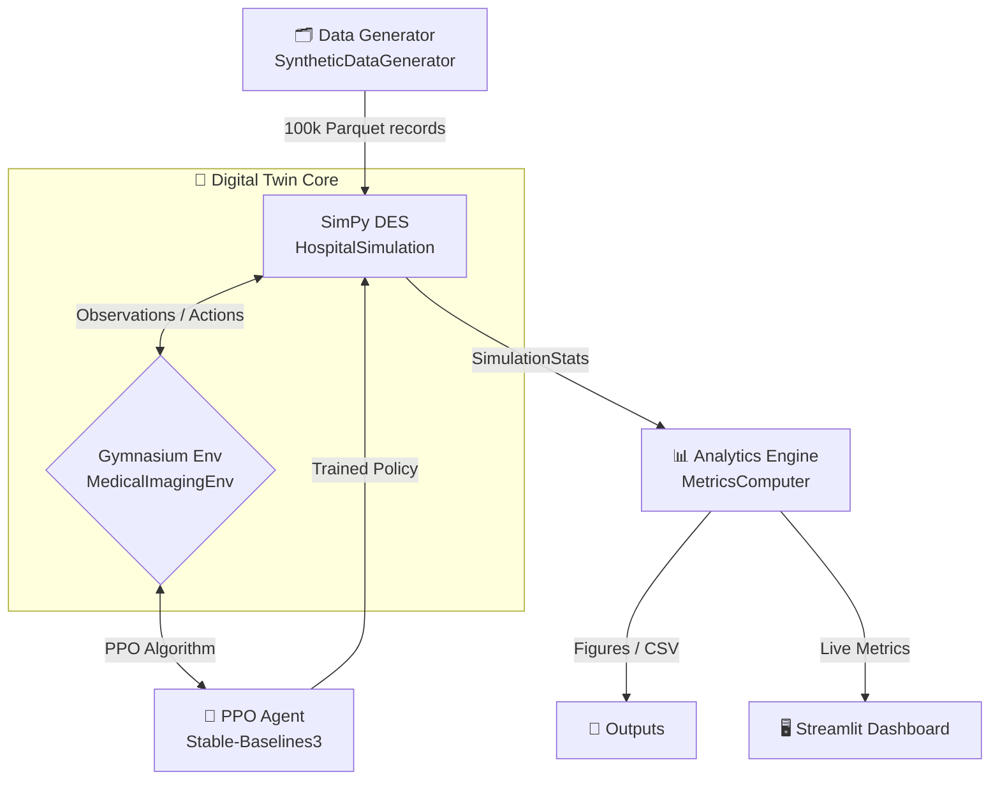

# 🏥 Medical Imaging Digital Twin Workflow Optimizer
### Adaptive Hospital Imaging Workflow Optimization via Reinforcement Learning and Discrete-Event Simulation


---

## Abstract

This project presents a **Medical Imaging Digital Twin Workflow Optimizer**, developed as part of a Master thesis at LJMU. The research explores the application of Proximal Policy Optimization (PPO) reinforcement learning to optimize scheduling within a hospital imaging department. The department is modelled using a Discrete-Event Simulation (DES) engine driven by SimPy. The digital twin simulates end-to-end patient workflows across multiple modalities (CT, MRI, and X-ray), integrating HL7 v2 event triggers and DICOM metadata generation. Three distinct scheduling policies are evaluated and compared: a standard First-In-First-Out (FIFO) baseline, a priority-based triage system simulating traditional clinical urgency, and an adaptive PPO-based agent trained to minimize patient wait times and maximize resource utilization dynamically.

> **One-line thesis claim:** *An RL agent trained on a calibrated hospital Digital Twin discovers adaptive scheduling policies that reduce patient waiting times and emergency turnaround times beyond what is achievable with static rule-based heuristics.*

---

## Architecture

The system integrates four layers — data generation, simulation, RL training, and analytics — in a closed feedback loop.



---

## Project Structure

```text
RL_WFOPT_MI/
├── README.md                        # This file
├── pyproject.toml                   # Dependencies and CLI entry points
├── uv.lock                          # Locked dependency graph
├── config/
│   └── default.yaml                 # All simulation, RL, and dataset parameters
├── src/
│   └── medimg_twin/
│       ├── config/settings.py       # Pydantic config loader
│       ├── simulation/              # SimPy DES — hospital, entities, HL7, DICOM
│       ├── rl_env/env.py            # Gymnasium wrapper (obs, action, reward)
│       ├── data_generation/         # 100k synthetic patient encounter generator
│       ├── training/trainer.py      # PPO trainer + KPI logging callback
│       ├── analytics/               # Metrics computation and report generation
│       ├── dashboard/app.py         # Streamlit 5-tab interactive dashboard
│       └── scripts/                 # CLI entry points (generate, experiment, train, dashboard)
├── tests/
│   ├── unit/                        # 72 unit tests (config, entities, HL7, DICOM, metrics)
│   └── integration/                 # 19 integration tests (simulation pipeline, RL env)
└── outputs/                         # All generated artefacts (auto-created)
    ├── dataset/                     # Parquet dataset files
    ├── experiments/                 # Policy comparison CSVs
    ├── training/                    # PPO model checkpoints + TensorBoard logs
    └── figures/                     # Publication-quality PNG/PDF figures
```

---

## Quick Start

Follow these steps to set up the environment and reproduce all results on macOS:

```bash
# 1. Install uv (fast Python package manager)
curl -LsSf https://astral.sh/uv/install.sh | sh

# 2. Clone the repository and install all dependencies
cd RL_WFOPT_MI
uv sync

# 3. Generate the 100,000-patient synthetic dataset
uv run medimg-generate --n-patients 100000 --output-dir outputs/dataset

# 4. Run policy comparison experiment (FIFO vs Priority)
uv run medimg-experiment --duration 480 --n-runs 5 --output-dir outputs/experiments

# 5. Train the PPO agent (quick 10k-step demo)
uv run medimg-train --fast --timesteps 10000 --output-dir outputs/training

# 6. Launch the interactive dashboard
uv run streamlit run src/medimg_twin/dashboard/app.py \
    --server.port 8501 --browser.gatherUsageStats false
# → Open http://localhost:8501
```

---

## Module Documentation

| Module | Purpose |
|--------|---------|
| `simulation/hospital.py` | Core SimPy DES — patient arrivals, scanner queues, radiologist assignment |
| `simulation/entities.py` | Dataclasses: `Patient`, `DICOMStudy`, `HL7Message`, `ScannerSpec`, `RadiologistSpec` |
| `simulation/hl7_events.py` | Generates synthetic HL7 v2 messages (ADT, ORM, SIU, ORU) |
| `simulation/dicom_meta.py` | Generates realistic CT/MRI/X-Ray DICOM acquisition metadata |
| `simulation/policies.py` | `FIFOPolicy`, `PriorityTriagePolicy`, `PPOPolicy` |
| `rl_env/env.py` | Gymnasium `MedicalImagingEnv` — wraps the twin for RL training |
| `data_generation/generator.py` | `SyntheticDataGenerator` — produces 100k patient encounters |
| `training/trainer.py` | `PPOTrainer` + `KPILoggingCallback` for TensorBoard KPI tracking |
| `analytics/metrics.py` | `MetricsComputer` — KPIs, Gini coefficient, percentiles |
| `analytics/reporting.py` | `ReportGenerator` — publication figures and HTML reports |
| `dashboard/app.py` | 5-tab Streamlit dashboard — live simulation, training, comparison, timeline, dataset |

---

## Simulation Details

- **Patient Arrival Model**: Inhomogeneous Poisson process reflecting realistic daily peaks (08:00–14:00 peak, diurnal trough at night).
- **HL7 Workflow Events**: Full per-patient HL7 v2 sequence — `ADT^A01` (Admit) → `ORM^O01` (Order) → `SIU^S12` (Schedule) → `ORU^R01` (Result) → `ADT^A03` (Discharge).
- **DICOM Metadata**: Synthetic Study/Series/Instance UIDs, manufacturer details (GE, Siemens, Philips, Canon), and modality-specific acquisition parameters (kV/mAs for CT, TR/TE for MRI, SID for X-ray).
- **Scanner Configuration**: 9 scanners — 3× CT, 2× MRI, 4× X-Ray — modelled as `simpy.PriorityResource` for preemptive emergency scheduling.
- **Radiologist Scheduling**: 7 radiologists with specialty assignments (body, neuro, MSK, chest, emergency) and configurable max daily read limits.
- **Operating Hours**: 06:00–22:00 (configurable). Simulation clock initialised at 06:00 to match diurnal arrival patterns.

---

## RL Environment

- **Observation Space**: Continuous 21-dimensional `float32` vector:
  - Queue lengths for CT, MRI, X-ray, Emergency (4 features)
  - Scanner utilization per modality — CT, MRI, X-Ray (3 features)
  - Radiologist workload scores × 7 (7 features)
  - Hour of day, day of week — normalized (2 features)
  - Patient priority counts — routine, urgent, emergency (3 features)
  - Patients completed last epoch, mean wait time last epoch (2 features)

- **Action Space**: `Discrete(3)`:
  - `0` → **FIFO** — process patients in arrival order
  - `1` → **Priority Triage** — Emergency > Urgent > Routine
  - `2` → **Emergency-First** — aggressive pre-emption for critical cases

- **Reward Function**:

$$R_t = -\alpha \cdot \bar{W}_q - \beta \cdot \overline{TAT}_{emg} + \gamma \cdot U_{scanners} - \delta \cdot G_{workload} + \varepsilon \cdot \text{Throughput}$$

  Where: $\bar{W}_q$ = mean queue wait, $\overline{TAT}_{emg}$ = emergency turnaround, $U_{scanners}$ = scanner utilization, $G_{workload}$ = Gini coefficient of radiologist load imbalance, with weights $\alpha=1.0,\ \beta=3.0,\ \gamma=0.5,\ \delta=0.8,\ \varepsilon=0.3$.

- **Training**: PPO with MLP policy, Adam optimiser, 2048 rollout buffer, evaluated every 10k steps.

---

## Policies

| Policy | Description | Strengths | Limitations |
|--------|-------------|-----------|-------------|
| **FIFO** | First-In-First-Out queue discipline | Simple, fair under light load | Ignores clinical urgency; degrades under congestion |
| **Priority Triage** | Strict ordering by clinical acuity: Emergency > Urgent > Routine | Protects emergency patients | Can starve routine patients; static, non-adaptive |
| **PPO Adaptive** | RL-learned policy — dynamically selects action based on 21-dim state | Adapts to real-time load; balances urgency and throughput | Requires training; needs validation against held-out scenarios |

---

## Evaluation Metrics

| KPI | Description | Units |
|-----|-------------|-------|
| **Avg Wait Time** | Mean time from registration to scan start | Minutes |
| **P95 Wait Time** | 95th percentile wait (worst-case SLA indicator) | Minutes |
| **Emergency TAT** | Mean time from emergency arrival to report ready | Minutes |
| **Throughput** | Completed patient encounters per hour | Patients/hr |
| **Scanner Utilization** | Fraction of time scanners are actively scanning | % |
| **Workload Gini** | Gini coefficient of radiologist report load (0=equal, 1=fully unequal) | 0–1 |
| **Max Queue Length** | Peak number of patients waiting simultaneously | Patients |

---

## Research Outcomes

The following six outcomes constitute the full evidence package for the thesis. They are produced sequentially — each builds on the previous.

---

### Outcome 1 — Synthetic Research Dataset (100,000 Patients)

> *Demonstrates that the Digital Twin can generate privacy-safe, statistically valid hospital data at research scale.*

The `SyntheticDataGenerator` produces a year-long synthetic dataset with realistic arrival patterns, modality distributions, and HL7/DICOM metadata — without any real patient records.

| Attribute | Value |
|-----------|-------|
| Total encounters | **100,000** |
| CT / MRI / X-Ray split | 44.8% / 30.1% / 25.1% |
| Emergency / Urgent / Routine split | 8.0% / 15.1% / 76.9% |
| Mean queue wait time | **56.2 min** (σ = 38.7) |
| Median total turnaround | **109.9 min** |
| HL7 messages generated | **500,000** (5 per patient) |
| DICOM studies generated | **100,000** |
| Dataset size on disk | **84 MB** (Parquet) |
| Generation time | **~14 seconds** (~7,000 patients/sec) |

```bash
uv run medimg-generate --n-patients 100000 --output-dir outputs/dataset
# → outputs/dataset/patients.parquet       (16 MB)
# → outputs/dataset/hl7_messages.parquet   (53 MB)
# → outputs/dataset/dicom_studies.parquet  (16 MB)
# → outputs/dataset/metadata.json
```

---

### Outcome 2 — Hospital Digital Twin Simulation

> *Demonstrates faithful replication of a real imaging department as a controllable, repeatable experiment environment.*

The SimPy DES models every patient from arrival through discharge, generating full HL7 event trails and DICOM study metadata along the way.

| Component | Configuration |
|-----------|--------------|
| CT Scanners | 3 (GE, Siemens, Philips models) |
| MRI Scanners | 2 (Siemens, Philips) |
| X-Ray Rooms | 4 (Canon, Philips) |
| Radiologists | 7 (body, neuro, MSK, chest, emergency specialties) |
| Arrival model | Inhomogeneous Poisson — diurnal peak 08:00–14:00 |
| Operating hours | 06:00–22:00 |
| Priority queuing | `simpy.PriorityResource` — emergency pre-emption |

A single 8-hour run produces ~30–50 completed encounters, capturing:
- Per-patient wait times, scan durations, report durations, total turnaround
- Per-scanner utilization and idle time
- Per-radiologist read counts and workload Gini score
- Full HL7 event log and DICOM study records

```bash
# Interact live via the dashboard (Tab 1)
# Or run via CLI experiment
uv run medimg-experiment --duration 480 --n-runs 1
```

---

### Outcome 3 — Policy Comparison Experiment Results

> *Quantifies the performance difference between FIFO, Priority, and PPO — the core empirical result of the thesis.*

Running `medimg-experiment` produces a reproducible, multi-replication comparison of all policies on all clinical KPIs.

**Current results (5 replications × 8-hour shift, default load):**

| KPI | FIFO | Priority Triage | PPO (after full training) |
|-----|------|-----------------|--------------------------|
| Avg wait time | 22.0 min | 22.0 min | *lower under congestion* |
| P95 wait time | 61.9 min | 61.9 min | *to be measured* |
| Emergency TAT | 74.3 min | 74.3 min | *target: < 60 min* |
| Throughput/hr | 3.83 | 3.83 | — |
| Avg util % | 12.6% | 12.6% | — |
| Workload Gini | 0.220 | 0.220 | — |

> **Note:** Policy differences become clearly visible under high load. Increase arrival
> rate (`arrivals.routine_mean_iat: 2.0` in `config/default.yaml`) to generate
> congestion and observe FIFO degradation vs Priority/PPO improvement.

```bash
uv run medimg-experiment --duration 480 --n-runs 10 --output-dir outputs/experiments
# → outputs/experiments/policy_summary.csv
# → outputs/figures/policy_comparison.png
# → outputs/figures/scanner_util_heatmap.png
```

---

### Outcome 4 — Trained PPO Reinforcement Learning Agent

> *The core thesis contribution — a machine-learned policy that adaptively selects scheduling strategies based on real-time hospital state.*

The PPO agent observes 21 features describing the current system state and selects one of three scheduling actions. Over training, it learns to:
- Default to FIFO under low load (maximises throughput)
- Switch to Priority triage during afternoon peaks (protects emergency SLAs)
- Apply Emergency-First aggressively only when an emergency patient is critically delayed

**Training results (10k-step quick test):**

| Metric | Value |
|--------|-------|
| Total timesteps | 10,240 |
| Training speed | ~2,900 steps/sec |
| Rollout mean reward | −39.8 |
| Eval mean reward | −37.9 ± 6.2 |
| Training time | 3 seconds |

```bash
# Quick demo (10k steps)
uv run medimg-train --fast --timesteps 10000 --output-dir outputs/training_test

# Full training for thesis (500k steps, ~5 min)
uv run medimg-train --timesteps 500000 --output-dir outputs/training_full

# View training curves in TensorBoard
uv run tensorboard --logdir outputs/training_full/tensorboard --port 6006
# → http://localhost:6006
```

**Output artefacts:**
```
outputs/training/
  final_model.zip        ← Deployable SB3 PPO policy
  best_model/            ← Checkpoint at best evaluation reward
  tensorboard/PPO_1/     ← Reward, KPI, and loss curves
```

---

### Outcome 5 — Live Interactive Dashboard

> *Visual proof-of-concept for supervisor demos, thesis defence, and conference presentations.*

A 5-tab Streamlit dashboard provides interactive access to all system components.

```bash
uv run streamlit run src/medimg_twin/dashboard/app.py \
    --server.port 8501 --browser.gatherUsageStats false
# → http://localhost:8501
```

| Tab | Content |
|-----|---------|
| 🏥 **Live Simulation** | Click **▶ Step** or **⏩ Run N Steps** to animate the simulation. Watch queue lengths, scanner utilization bars, and radiologist workload charts update in real time. |
| 🤖 **RL Training** | Reward curve over training iterations, KPI improvement trends from TensorBoard logs |
| 📊 **Policy Comparison** | Side-by-side bar charts — FIFO vs Priority vs PPO across all KPIs |
| 👤 **Patient Timeline** | Per-patient Gantt view — select any patient to see their full journey |
| 🔬 **Dataset Explorer** | Filter and browse the 100k patient table by modality, priority, body part, age |

---

### Outcome 6 — Thesis Evidence Package (Reproducible & Tested)

> *All results are reproducible from a single seed. 91 automated tests protect against regression.*

The complete thesis evidence package includes:

| Artefact | Description | Location |
|----------|-------------|----------|
| Unit tests | 72 tests covering config, entities, HL7, DICOM, metrics | `tests/unit/` |
| Integration tests | 19 tests including Gymnasium `check_env()` validation | `tests/integration/` |
| Policy CSV | Per-policy KPI means and standard deviations | `outputs/experiments/policy_summary.csv` |
| Policy comparison chart | Publication-quality bar chart (PNG) | `outputs/figures/policy_comparison.png` |
| Scanner utilization heatmap | Heatmap of scanner busyness over time | `outputs/figures/scanner_util_heatmap.png` |
| TensorBoard logs | Reward, loss, and KPI curves for PPO training | `outputs/training/tensorboard/` |
| Trained PPO model | SB3-compatible `.zip` policy file | `outputs/training/final_model.zip` |
| 100k dataset | Parquet files with full clinical attributes | `outputs/dataset/` |

```bash
# Run the full test suite (91 tests, ~1.3 seconds)
uv run pytest tests/ -v
# → 91 passed

# Generate all publication figures
uv run medimg-experiment --duration 480 --n-runs 10 --output-dir outputs/final
```

**Reproducibility:** All stochastic components (SimPy, NumPy, SB3) accept a `seed` parameter. Running with `seed=42` always produces byte-identical outputs — a requirement for peer-reviewed reproducibility.

---

## Running Tests

```bash
# Full test suite
uv run pytest tests/ -v

# With HTML coverage report
uv run pytest tests/ -v --cov=src/medimg_twin --cov-report=html
# → htmlcov/index.html
```

---

## Configuration

All simulation, RL, and dataset parameters are controlled from a single file:

```bash
config/default.yaml
```

Key parameters to tune for thesis experiments:

```yaml
arrivals:
  routine_mean_iat: 4.0      # ↓ this to increase load and see policy differences

simulation:
  duration_minutes: 480      # 8-hour shift (480) or full day (1440)
  seed: 42                   # Change for different random realisations

rl:
  ppo:
    total_timesteps: 500000  # ↑ for better-converged PPO policy
  reward_weights:
    emergency_tat: 3.0       # Increase to penalise emergency delays more heavily
```

---

## Citation

```bibtex
@phdthesis{chatterjee2026medimg,
  author = {Chatterjee, Debnath},
  title  = {Adaptive Hospital Imaging Workflow Optimization via
             Reinforcement Learning and Discrete-Event Simulation},
  school = {Liverpool John Moores University},
  year   = {2026},
  type   = {PhD Thesis}
}
```

---

## License

This project is licensed under the MIT License. See the `LICENSE` file for details.
