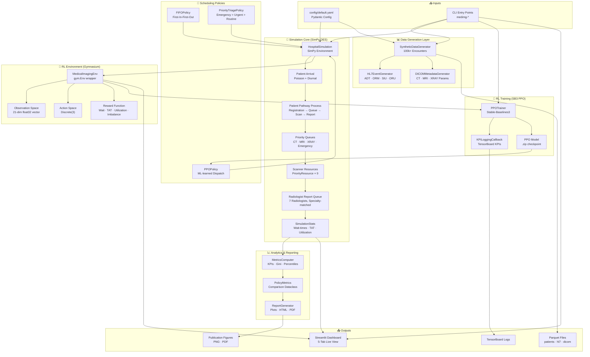
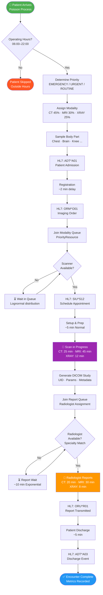
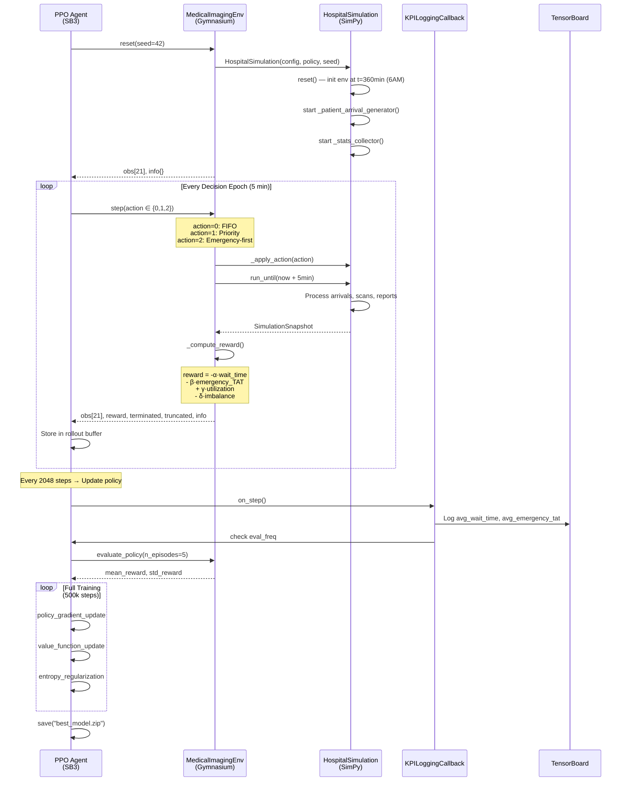
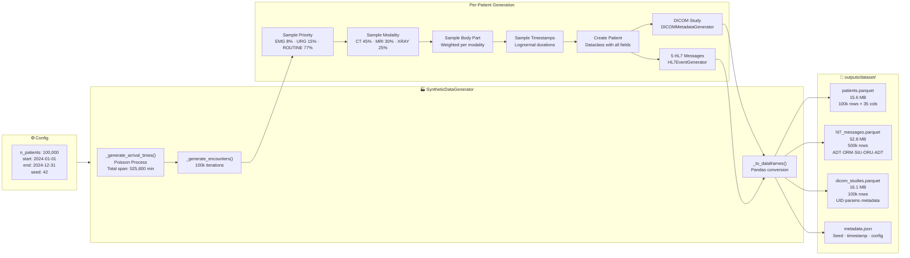
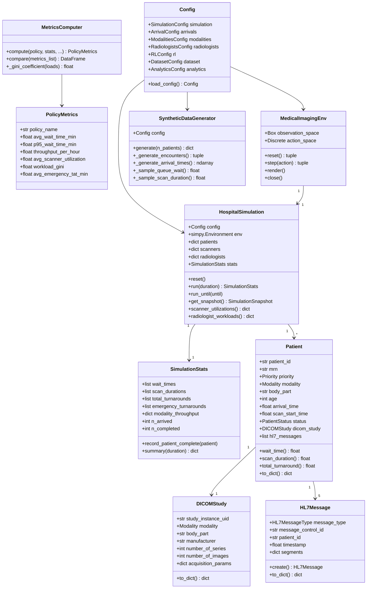
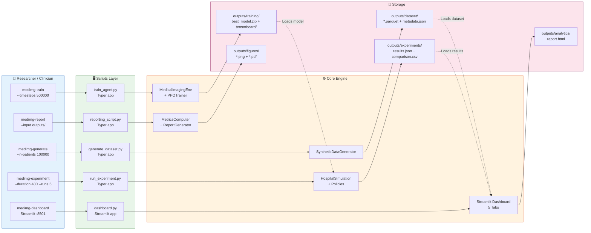
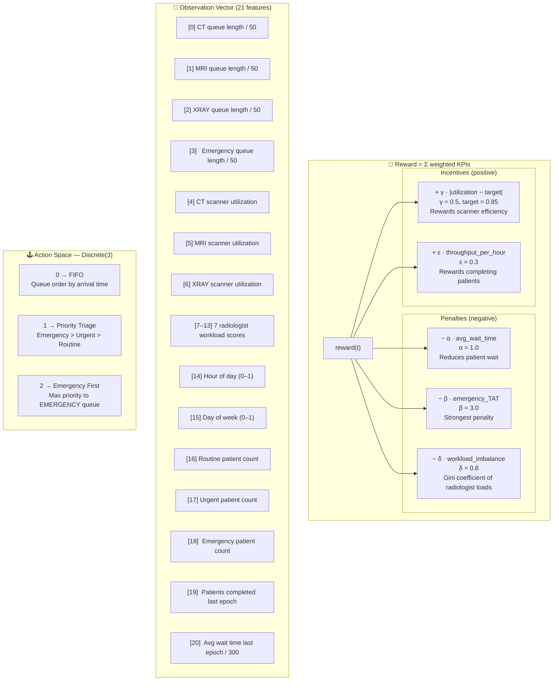
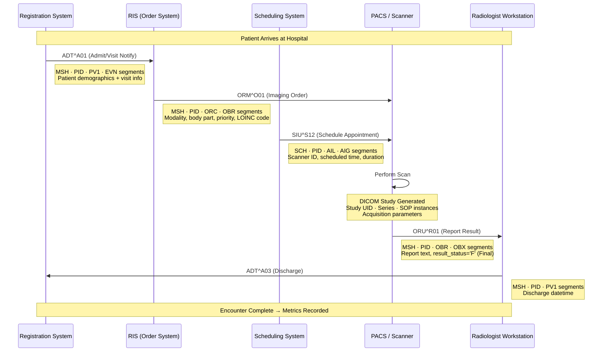

# Medical Imaging Digital Twin Workflow Optimizer
## Architectural Design & Flow Diagrams

---

## 1. System Architecture Overview

---

## 2. Patient Journey Flow (Full Pathway)

---

## 3. RL Training Loop

---

## 4. Data Generation Pipeline

---

## 5. Class Hierarchy & Relationships

---

## 6. SimPy Simulation Internal Timeline

```mermaid
gantt
    title Patient Encounter Timeline (Approximate Durations)
    dateFormat  mm
    axisFormat  %M min

    section Patient Arrives
    Arrival event          :milestone, 00, 0min

    section Registration
    HL7 ADT-A01 sent       :milestone, 00, 0min
    Registration delay     :reg, 00, 2min

    section Ordering
    HL7 ORM-O01 sent       :milestone, 02, 0min
    Order processing       :ord, 02, 3min

    section Queue Wait
    HL7 SIU-S12 sent       :milestone, 05, 0min
    Waiting for scanner    :crit, wait, 05, 45min

    section Scan
    Setup / prep           :setup, 50, 5min
    CT Scan in progress    :active, scan, 55, 25min

    section DICOM Generation
    Study metadata created :milestone, 80, 0min

    section Reporting
    Report queue wait      :rwait, 80, 10min
    Radiologist reporting  :active, report, 90, 20min

    section Discharge
    HL7 ORU-R01 sent       :milestone, 110, 0min
    Discharge processing   :disc, 110, 5min
    HL7 ADT-A03 sent       :milestone, 115, 0min
```

---

## 7. Deployment & CLI Interface

---

## 8. Reward Function Decomposition

---

## 9. HL7 Message Flow (Healthcare Interoperability)

---

## Key Design Decisions

| Design Choice | Rationale |
|---------------|-----------|
| **SimPy DES** | Causal, event-driven; enables exact replay with same seed |
| **PriorityResource** | Native SimPy priority queuing for emergency pre-emption |
| **6 AM clock start** | Simulation env initialised at operating hours start so arrivals aren't filtered |
| **Gymnasium wrapper** | Industry standard; enables plug-in of any SB3 algorithm |
| **Discrete(3) action space** | Maps cleanly to interpretable scheduling heuristics |
| **21-dim observation** | Captures all clinically relevant queue + resource state |
| **Parquet output** | Columnar, compressed, fast for 100k rows analytics |
| **Pydantic config** | Type-safe YAML loading with validation and defaults |
| **`numpy.default_rng`** | Modern numpy Generator API; reproducible across all stochastic components |
| **Modality-specific DICOM params** | CT/MRI/XRAY have physically distinct parameter sets (kV, TR/TE, SID) |
